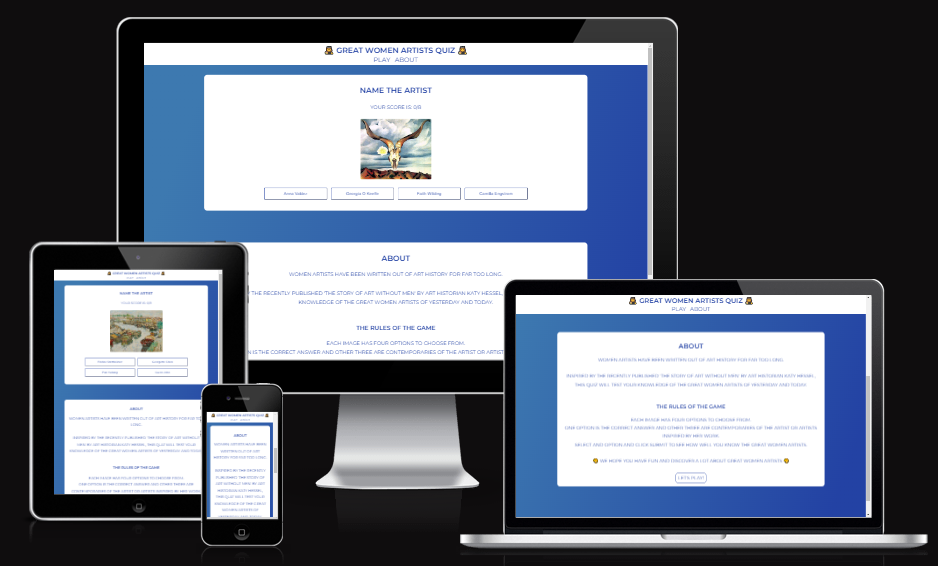
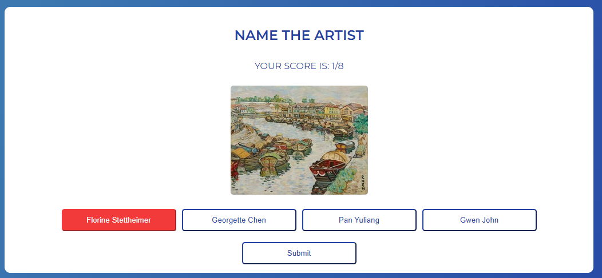
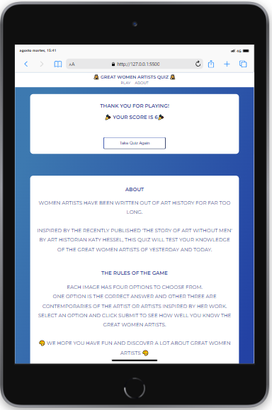
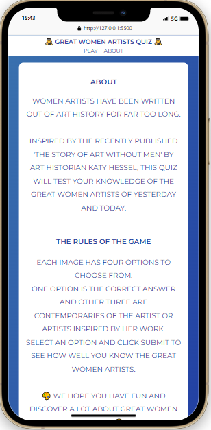
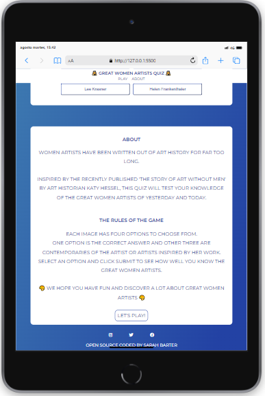

# Art Quiz App

## The Purpose of the Project

This is an art quiz app intended to test the user's knowledge of Great Women Artists and their artworks. This quiz was inspired by the recently published 'The Story of Art Without Men' by Katy Hessel, and hopes to promote an interest in the user to further explore the works of Great Women Artists throughout history and today.

### User Stories

- Home Page - As a visiting user, I want to be able to start the quiz immediately. I want to see the correct or incorrect answer after making my selection and I want to see my score recorded.

- End Section - As a visiting user, I want to see my final result after completing the quiz and have the option to take the quiz again.

- About Section - As a visiting user, I want to learn more about the quiz and the rules for how to play. I want to find a link for further information about Great Women Artists.

### Features

- Nav Bar - The title of the quiz is visible in larger text and directly underneath are links taking the user to the About section or the Play section. The user's score is not lost on navigating to the About section. The game is refreshed on clicking the 'Play' link.

- Game Start Section - The user can immediatly see the main question to answer in the game. They then see their score. It placed at the top to allow for greater user focus. The user is then presented with an image immediately on page load and can choose between four artists' names.

On clicking one answer option, it is highlighted in blue and the button to submit the answer appears.

If the correct answer is selected, the option will turn green and the score tally at the bottom of the page will increase by 1. There is a timeout handler to allow the user to see if they have chosen the correct/incorrect answer. The next image will then be shown.

If the incorrect answer is selected, the selected option will turn red. The score will not be updated. Again there is a timeout handler. Then the next image will be shown.

- Game-End Section - When the user has seen/answered eight images, they will be presented with their total correct score and the option to take the quiz again.

- About Section - this section explains the idea behind the quiz and the basic rules on how to play. It has a button with a link to navigate to the top of the game, the player's score, if they have already started the game, is not affected.

- Footer - There are links to the typical social media sites and links to the coder's LinkedIn and the site's GitHub Repository page.

### Future Features

- Question options - I would like to add more question images and options to make the quiz bigger and more engaging.
- High Score Record - I would like to add a page which keeps a record of the names of the players with the highest scores.
- Links to learn more - I would like to add wikipedia links for each of the artists mentioned in the quiz so the user can easily learn more about an artwork or artist that they might like, further supporting the purpose of the project to educate people about Great Women Artists.

### Typography and Color

- Typography: The font Monserrat was chosen. It was developed as a result of the old posters and signs in the traditional Montserrat neighborhood of Buenos Aires. It is reminiscent of the urban typography that emerged in the first half of the twentieth century and has a clear, easily readable style. All the text on the site, except the answer options, is capitalized for stylistic purposes.

- Color-scheme - the colors blue and white were chosen to allow for adequate accessibility and readability and so as not to distract the user from the images that will be shown in the quiz. The background of the main section is a linear-gradiant selected from the SheCodes free access linear-gradiant library.

### Wireframes

- As the wireframes indicate, the idea for the project was to keep it as simple as possible. The site loads the quiz immediately. No time limit to answer each question was included so the user has time to study the image and read all the names in the options. The result area appears when the user reaches the end of the quiz. The About page was added to the project as it was being developed and built and so is not included in the wireframes.
- The wireframes were made using wireframepro.mockflow.com.

· Game Section - small/large screen devices

·End of Game Section - small/large screen devices

### Technology

- GitHub Desktop for commits/deploys
- VS Code
- CSS, HTML, JavaScript
- GoogleFonts
- https://gradients.shecodes.io/ - for background gradient code
- https://wireframepro.mockflow.com/ - for wireframe design
- FontAwesome for social media links
- https://www.iloveimg.com/ - to resize images
- https://ui.dev/amiresponsive - to check site responsiveness

### Testing

- HTML - https://validator.w3.org/ - no errors found
- CSS - https://jigsaw.w3.org/css-validator/ - no errors found
- JavaScript - https://jshint.com/ - no errors found

### Test Cases

#### Play Page

##### Game Section

1. As the user lands on the quiz homepage, they will see the nav-bar with the title of the quiz and below that, a link to 'Play', which will refresh the page, and to 'About', which will navigate the user to the About page.
2. Immediately below the nav-bar the user sees the quiz section. They will see the main question - 'Name the artist', which is what they must do throughout the quiz.
3. Below the question, there will be an image of an artwork. This image changes when the user clicks on one of the artist option buttons, essentially starting the quiz.
4. There are four artist option buttons just under the image. One of the buttons is the correct answer and will turn green when selected - indicating the user was correct. If the user selects an incorrect answer, it will turn red. The correct answer will not be shown. The user can only discover the correct answer by re-taking the quiz.
5. Below the artist options the user will see their score tally. This will increase by one if they answer correctly, or remain unchanged if they answer incorrectly. The total number of questions in the quiz is eight. However, there are 18 images for the quiz to randomly select from, therefore ensuring the user can play multiple times without the risk of having every question repeated.
6. The user will then see the footer which has three icons for social media websites and the author's line with links to their LinkedIn profile and the GitHub repository for the quiz. All links open in a new tab.

 

##### End Section

1. When the user has answered eight questions the quiz section inner html will change to the end section html.
2. The user will see a message congratulating them on finishing the quiz. They will see their total correct score. And they will see a button inviting them to take the quiz again.
3. On clicking the Take Quiz Again button, the screen will refresh and the quiz will start from 0 again.

 

#### About Page

1. When the user clicks the 'About' link in the nav-bar, they will be directed to the About page.
2. They will see the same nav-bar and footer as on the home page.
3. The user will see a brief explanation of the inspiration behind the quiz which contains a link to 'The Story of Art Without Men' book website which opens in a new tab.
4. The user will then see a button 'Let's Play'. When clicked, the user will be navigated back to the Play page, the main page of the site, where they can begin the quiz.

 

### Supported Screens and Browsers

- The site is fully responsive. It presents well on small and medium-sized devices with no horizontal overflow, as well as on large screen devices.

- It is supported on Google Chrome, Microsoft Edge, Firefox and Safari.

### Bug Fixes

- After testing the HTML code for the site, I had to fix two minor errors on the <image> element - I had to include the alt and the src attributes. No other errors were found.

- After testing the CSS code for the site, I had to fix one minor error on the <image> element - I had to correct the value for max-height. No other errors were found.

- After testing the JavaScript code for the site, I had to fix one minor error - I had declared a variable for container/gameSecton but had never used it in the code. So, I updated the function displayEndSection () to fix the bug.

### Deployment

#### VS Code:

- I used the Code Institute template available on GitHub with VS Code as the editor for this project.

1. Create the file on the desktop
2. Open it in the VS Code desktop programme
3. Add the HTML files, Javascript files and assets folder with CSS file and images for the quiz.

#### GitHub Desktop application

- I used this application to conveniently commit and push changes to the GitHub repository for this project.

#### GitHub pages for deployment

- The steps I took to deploy the project:

1. naviagate to Settings on the GitHub repo page
2. click on Pages
3. click deploy from branch.

I sometimes had to manually update the repository by:

1. clicking on the 'Last deployed' link on the Pages page
2. clicking on 'Re-run all jobs' on the Actions page

The live link can be found here: https://barty-s.github.io/art-quiz-app/index.html

#### To clone the repo:

1. On GitHub click on the green <> Code button,
2. In the dropdown menu select Local and copy the url for the repository.
3. Create a file on your desktop and right click to open with code, ie your local environment.
4. On the welcome page select the option Clone Git Repo and paste the URL.
5. Save it to the folder you created on your desktop.

### Credits

#### Content

- 'Create a Quiz App using HTML, CSS & JavaScript' by CodeGeek https://www.youtube.com/watch?v=Opje9VBrNfg&t=1791s - this video was used for the structure of the Javascript code.
  While using this tutorial as a learning tool for this project, the code was customised as much as possible to fit the scope of the Art Quiz app project and to ensure plagiarism was avoided.
- https://stackoverflow.com/questions/5480945/refreshing-page-on-click-of-a-buttons - this site helped solve the problem I had with the code for restarting the quiz with the button click.
- https://css-tricks.com/snippets/css/a-guide-to-flexbox/#aa-background - this site breaks down the specificities of flexbox.
- https://www.freecodecamp.org/news/three-dots-operator-in-javascript/ - for explanation of the three dot spread operator in JavaScript
- https://www.w3schools.com/js/js_arrow_function.asp - for explanation of the arrow function in JavaScript
- https://sabe.io/blog/javascript-yes-no-confirmation-box and https://stackoverflow.com/questions/32394684/how-to-confirm-and-call-function-with-onclick - for explanation of Confirm box in JavaScript
- https://www.scaler.com/topics/javascript/import-js-file-in-js/ - for explanation of linking two JS files
- https://stackoverflow.com/questions/54358737/add-and-remove-id-by-pure-javascript - for explanation on adding/removing IDs
- Craig Hudson in the CI slack community who helped me fix a bug on the select answer options

#### Media

- Images sourced from Google with the Creative Commons License and used solely for educational purposes.
- Icon images - Font Awesome library https://fontawesome.com/
- Font - Google Font library https://fonts.google.com/
