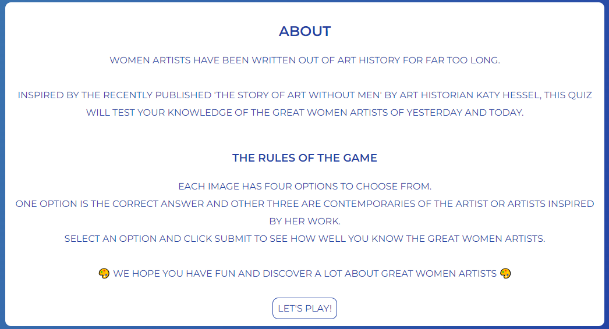

# Art Quiz App

## The Purpose of the Project

This is an art quiz app intended to test the user's knowlegde of Great Women Artists and their artworks. This quiz was inspired by the recently published 'The Story of Art Without Men' by Katy Hassel, and hopes to promote an interest in the user to further explore the works of Great Women Artists throughout history and today.

### User Stories

- Home Page - As a visiting user, I want to be able to start the quiz immediately without having to introduce my name or age. I want to see the correct or incorrect answer after making my selection and I want to see my score recorded.

- End Section - As a visiting user, I want to see my final result after completing the quiz and have the option to take the quiz again.

- About Page - As a visiting user, I want to learn more about the quiz and find a link to further information about Great Women Artists.

### Features

- Nav Bar - the same nav-bar design appears on both pages of the site. The title of the quiz is visible in larger text and directly underneath are links taking the user to the About page or the Play page.

- Game Start Section - The user is presented with an image immediately on page load and can choose between four artist's names.

If the correct answer is selected, the option will turn green and the tally at the bottom of the page will increase by 1. The next image will then be shown.

If the incorrect answer is selected, the selected option will turn red. The score will not be updated. Then the next image will be shown.

- Game End Section - When the user has seen eight images, they will be presented with their total correct score and the option to take the quiz again.

- Footer - The same footer structure is used on both pages. There links to the typical social media sites and links to the coder's LinkedIn and the site's GitHub Repository page.

- About Page - this page explains the idea behind the quiz and has a button with a link to start the quiz.

### Future Features

- Question options - I would like to add more question images and options to make the quiz bigger and more engaging.
- High Score Record - I would like to add a page which keeps a record of the names of the players with the highest scores.
- Links to learn-more - I would like to add links to each of the artists mentioned in the quiz so the user can easily learn more about an artwork or artist that they liked, further supporting the purpose of the project to educate people about Great Women Artists.

### Typography and Color

- Typography: The font Monserrat was chosen. It was developed as a result of the old posters and signs in the traditional Montserrat neighborhood of Buenos Aires. It is reminiscent of the urban typography that emerged in the first half of the twentieth century.

- Color-scheme - the colors blue and white were chosen to allow for adequate accessibility and readability. And so as not to distract the user from the images that will be shown in the quiz. The background of the main section is a linear-gradiant selected from the SheCodes free access linear-gradiant library.

### Wireframes

- As the wireframes show, the idea for the project was to keep it as simple as possible. The site loads the quiz immediately. No time limit to answer each question was included so the user has time to think and read all the names in the options. The result area appears when the user reaches the end of the quiz. The About page was added to the project as the it being developed. The wireframes were made using wireframepro.mockflow.com.

### Technology

- GitHub Desktop for commits/deploys
- VS Code
- CSS, HTML, JavaScript
- GoogleFonts
- SheCodes for Background gradient code
- https://wireframepro.mockflow.com/ - for wireframe design
- FontAwesome for social media links
- https://www.iloveimg.com/ - to resize images
- https://ui.dev/amiresponsive - to check site responsiveness

### Testing

### Test Cases

### Supported Screens and Browsers

### Bug Fixes

### Deployment

#### VS Code:

- I used the Code Institute template available on GitHub with VS Code as the editor for this project.

1. Create the file on the desktop
2. Open it in the VS Code desktop programme
3. Add the HTML files, Javascript files and assets folder with CSS file and images for the quiz.

#### GitHub Desktop application

- I used this application to conveniently commit and push changes to the GitHub repository for this project.

#### GitHub pages for deployment

- The steps I took to deploy the project:

1. naviagate to Settings on the GitHub repo page
2. click on Pages
3. click deploy from branch.

I had to manually update the repo each time by:

1. clicking on the 'Last deployed' link on the Pages page
2. clicking on 'Re-run all jobs' on the Actions page

The live link can be found here:

#### To clone the repo:

1. On GitHub click on the green <> Code button,
2. In the dropdown menu select Local and copy the url for the repository.
3. Create a file on your desktop and right click to open with code, ie VS Code, your local environment.
4. On the welcome page select the option Clone Git Repo and paste the URL.
5. Save it to the folder you created on your desktop.

### Credits

#### Content

- Create a Quiz App using HTML, CSS & JavaScript - by CodeGeek https://www.youtube.com/watch?v=Opje9VBrNfg&t=1791s - this video was used for the structure of the Javascript code and it was customised as much as possible to fit the needs of the art quiz.
- https://stackoverflow.com/questions/5480945/refreshing-page-on-click-of-a-buttons - this site helped solve the problem of restarting the quiz with the button click
- https://css-tricks.com/snippets/css/a-guide-to-flexbox/#aa-background - this site breaks down the specificities of flexbox.

#### Media

- Images sourced from Google with the Creative Commons License and used solely for educational purposes.
